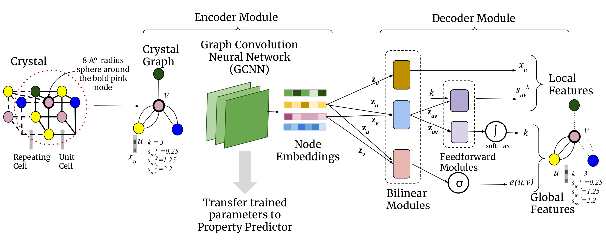
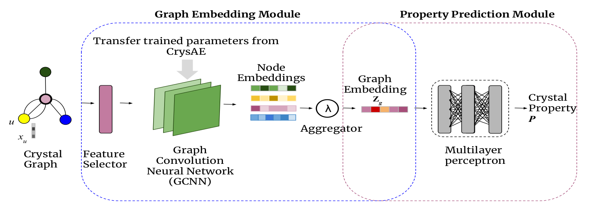

# CrysXPP: An Explainable Property Predictor for Crystalline Materials

This is software package for Crsytal Explainable Property Predictor(CrysXPP) that takes as input
any arbitary crystal structure in .cif file format and predict different state and elastic properties
of the material.

It has two modules :

- Crystal Auto Encoder (CrysAE) : An auto-encoder based architecture which is trained with a large amount of unlabeled crystal data which leads to the deep encoding module capturing all the important structural and chemical information of the constituent atoms (nodes) of the crystal graph. 

    
    <div align='center'><strong>Figure 1. CrysAE Architecure.</strong></div>
    
- Crystal eXplainable Property Predictor (CrysXPP) : An Explainable Property Predictor, to which the knowledge acquired by the encoder is transferred and which is further trained with a small amount of property-tagged data.

    
    <div align='center'><strong>Figure 2. CrysXPP Architecure.</strong></div>

The following paper describes the details of the CrysXPP framework:

[CrysXPP: An Explainable Property Predictor for Crystalline Materials](https://arxiv.org/pdf/2104.10869.pdf)

## Table of Contents

- [How to cite](#how-to-cite)
- [Requirements](#requirements)
- [Usage](#usage)
  - [Define a customized dataset](#define-a-customized-dataset)
  - [Train a CrysAE model](#train-a-crysae-model)
  - [Train a CrysXPP model](#train-a-crysxpp-model)
- [Data](#data)
- [Authors](#authors)
- [License](#license)


## How to cite

If youare using CrysXPP, please cite our work as follow :

```
@misc{das2021crysxppan,
      title={CrysXPP:An Explainable Property Predictor for Crystalline Material}, 
      author={Kishalay Das and Bidisha Samanta and Pawan Goyal and Seung-Cheol Lee and Satadeep Bhattacharjee and Niloy Ganguly},
      year={2021},
      eprint={2104.10869},
      archivePrefix={arXiv},
      primaryClass={cond-mat.mtrl-sci}
}
```


##  Requirements

The package requirements are listed in requirements.txt file. Run the following command to install dependencies in your virtual environment:

pip install -r requirements.txt

## Usage

### Define a customized dataset 
(Customiation is adopted From CGCNN Paper)

To input crystal structures to CrysAE and CrysXPP, you will need to define a customized dataset. Note that this is required for both training and predicting. 

Before defining a customized dataset, you will need:

- [CIF](https://en.wikipedia.org/wiki/Crystallographic_Information_File) files recording the structure of the crystals that you are interested in
- The target properties for each crystal (not needed for predicting, but you need to put some random numbers in `id_prop.csv`)

You can create a customized dataset by creating a directory `root_dir` with the following files: 

1. `id_prop.csv`: a [CSV](https://en.wikipedia.org/wiki/Comma-separated_values) file with two columns. The first column recodes a unique `ID` for each crystal, and the second column recodes the value of target property. 
2. `atom_init.json`: a [JSON](https://en.wikipedia.org/wiki/JSON) file that stores the initialization vector for each element. An example of `atom_init.json` is `data/sample-regression/atom_init.json`, which should be good for most applications.

3. `ID.cif`: a [CIF](https://en.wikipedia.org/wiki/Crystallographic_Information_File) file that recodes the crystal structure, where `ID` is the unique `ID` for the crystal.

The structure of the `root_dir` should be:

```
root_dir
├── id_prop.csv
├── atom_init.json
├── id0.cif
├── id1.cif
├── ...
```

There is a examples of customized dataset in the repository: `../data/`, with 37K cif files, where in id_prop file we have formation energy values.

### Train a CrysAE model

We have already trained the autoencoder with 37K data and a pretrained model (model_pretrain.pth) will be provided into the '../model' directory.

Yet, if You want to train the autoenoder module from scratch by some other dataset, use the following procedure :
- [Define a customized dataset](#define-a-customized-dataset) at `root_dir` to store the structure-property relations of interest.
- Run the following command

```bash
python main.py --data-path '../data/' --is-global-loss <1/0> --is-local-loss <1/0>  --save-path <path_to_save_pretrained_model>
```
Once the training is done the saved model will be saved at save-path.

### Train a CrysXPP model
Before training a new CrysXPP model, you will need to:

- [Define a customized dataset](#define-a-customized-dataset) at `root_dir` to store the structure-property relations of interest.

You can train the property predictor module by the following command :

```bash
python prop.py --pretrained-model=<Pretrain_CrysAE_path> --batch-size=512 --epoch=200 --test-ratio=0.8
```
As "pretrained-model" you can either use the existing pretarined CrysAE model "model/model_pretrain.pth" or you can pretrain your own  [CrysAE model](#train-a-crysae-model) and use the saved model.

Here you can set set the following hyperparameters :

- lrate : Learning Rate (Default : 0.003).
- atom-feat : Atom Feature Dimension (Default : 64).
- nconv : Number of Convolution Layers (Default : 3).
- epoch : Number of Training Epochs (Default : 200)
- batch-size : Batch size of data (Default : 512).


After training, you will get following files :

- ``../model/model_pp.pth`` : Saved model for that particular property.
-  ``../results/Prediction/<DATE>/<DATETIME>/out.txt`` : All the traing results for all epochs and all the hyperparameters are saved here.

## Data

We have used the dataset provided by [CGCNN](https://github.com/txie-93/cgcnn). Please use the dataset to reproduce the results. CIF files are given in the "data/" directory and in id_prop file we have formation energy values.

## Authors

This software was primarily written by [Kishalay Das](https://kdmsit.github.io/) & [Bidisha Samanta](https://sites.google.com/view/bidisha-samanta/) 
and was advised by [Prof. Niloy Ganguly](http://www.facweb.iitkgp.ac.in/~niloy/), , [Prof. Pawan Goyal](https://cse.iitkgp.ac.in/~pawang/), Dr. Satadeep Bhattacharjee and Dr. Seung-Cheol Lee. 

## License

CrysXPP is released under the MIT License.
